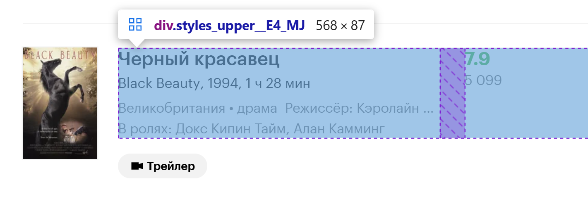
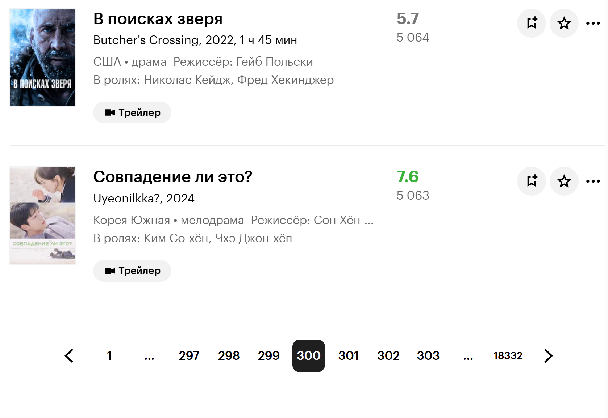

# Групповой проект по теме "Сравнение популярности кино в мире и России"

Предмет "Современные методы анализа данных и машинного обучения"

Команда 37: \
Фролов Александр \
Гончаров Григорий \
Емцов Марк \
Крынин Владимир

## Web-scraping

По заданию один из источников данных должен быть обработан с помощью парсинга веб-страницы (web-scraping). Для оценки российского рынка просмотра фильмов и сериалов сразу в голову приходит идея взять данные с Кинопоиска (сервис стриминг кино от Яндекса). И так как официального API он не предоставляет, а более полной картины оценок кино в России мы нигде не получим (другие сервисы менее ориентированы на зарубежные фильмы и сериалы), будем скрепить именно КП.

Первая и наверное единственная серьезная трудность, с которой мы столкнулись - блокировщик программы скрепинга. А проявляется это в высвечивании спецаильной капчи (Smart Captcha специально от Яндекса) в два уровня: поставить галочку, что ты не робот, и кликать по предметам в заданном порядке.

Как мы решали эту проблему?
1) Уже так давно существует проблема обхода каптч - наверняка уже главные умы мира все сделали за нас. Было ошибочно на это надеяться. Точнее, такие решения и правда есть, но ориентированы они в основном на гугловские капчи или другие американские, а для нашего рынка такого мало. Мы провели небольшой рисерч, но так и не смогли подобрать ключик к нашему ЯЗамку.
2) Будем итерироваться по страницам и максимально имитировать движения человека с помощью программы, благо такой функционал доступен в библиотеке Selenium. А если каптча вылезает, то ее будет решать ответственный член нашей команды (оператор). Так во время рисерча мы нашли продвинутый selenium - seleniumbase, который при подключении экрана с сайтом через зашифрованный cdp (система сбора данных о пользователе), благодаря чему каптча вылезает реже. Однако даже при таком раскладе мы замерили время обработки одной страницы и получилось, что нашему бедолаге-оператору пришлось бы сидеть в концентрации около компьютера примерно день. Мы любим СМАДиМО, но не готовы идти на такое.
3) А давайте полностью действовать как человек - не забивать каждый раз адрес сайта с измененным параметром page=, а нажимать на кнопки перехода по страницам. О да! Это работает - каптчу может попросить только при самом первом входе и все...

Дальше была еще небольшая проблема как собирать данные с сайта?
1) обычным способом как в find_all в BeautifulSoup по тегам получаем нужные поля, но тут ждал сюрприз - не у всех фильмов был набор всех элементов, поэтому склеить без ошибок все массивы данных по фильмам с одной страницы не получится
2) будем перебирать контейнеры каждого фильма и в каждом по тегу искать нужные поля

Итоговый скрипт (page_seqv2.py) отработал на ура:
- задача была обработать 1000 страниц (на каждой по 50 фильмов)
- алгоритм работал 2 часа и 7 минут
- спарсил 47.777 строк информации о кино
- остальные 2223 не имели достаточно полезной информации (только название), поэтому не были включены в итоговый датасет

Также по итогам работы парсера и обработки полученных сырых данных с сайта был сформирован датасет. \
Сохранен в файл 'kinopoisk.csv'. Имеет 47777 записей с 12 признаками (полями).

[Сайт](https://www.kinopoisk.ru/lists/movies/?utm_referrer=organic.kinopoisk.ru&b=foreign), который парсили

Документация [SeleniumBase](https://seleniumbase.io/)

Пример контейнера фильма:


Кнопки перехода по страницам:



## API TMDB

Данный раздел был направлен на обогащение исходного датасета информацией для дальнейшего анализа.
Цель проекта - это анализ рынка кино и мас. медиа в разрезе оценок в РФ и остальном мире.

1) За оценки в РФ были взяты оценки Кинопоиска (результат скрапинга, данная площадка принята за Бизнес-заказчика).
2) За оценки в мире были взяты данные от TMDB, как глобального агрегатора данной информации.

Ссылки на платформы:

1) Кинопоиск: https://www.kinopoisk.ru/?utm_referrer=www.yandex.ru
2) TMDB: https://developer.themoviedb.org/docs/faq

---

### Пайплайн раздела API

| Тип  | Описание объекта |
|-----------|----------|
| Вход  |kinopoisk.csv - данные собранные из скрапинга сайта. Размер: 47777 строк и 12 колонок|
| Выход  | Датасет содержащий исходные поля и добавленные. Подробнее о полученных данных см. ниже. Размер: 41367 строк и 32 колонки (кол-во строк уменьшилось, потому что были удалены дубликаты) |


1) Получение даннных и оперирвоание и 3 исходными полями: 
    - 'russian_title'
    - 'english_title'
    - 'is_film'
2) Endpoint №1 - получаем базовую информацию по названию фильма и 'id' на платформе tmdb. Данное поле понадобится для остальных endpoint-ов;
3) Endpoint №2 - получаем справочник жанров фильмов на площадке;
4) Endpoint №3 - получаем финансовые показатели по 'id' фильма;
5) Endpoint №4 - получаем название стриминговых сервисов, кто обладает правами на показ фильма (по 'id'). Права делятся на аренду и продажу;
6) Endpoint №5 - получаем ключевые слова о фильме;
7) Склеиваем исходный датасет и собранный датасет в ходе всех endpoint-ов;
8) Проводим наименование колонок в приличный вид, чистим дубликаты и сохраняем итоговый файл: 'total_df.xlsx'.

---

### Endpoint-ы

| Endpoint №  | Ссылка для запроса (get) | Описание |
|-----------|----------|----------|
| 1 | https://api.themoviedb.org/3/search/movie | Поиск фильма по названию и получение базовых полей |
| 2 | https://api.themoviedb.org/3/genre/movie/list | Справочник жанров |
| 3 | https://api.themoviedb.org/3/movie/ | Финансовые показатели фильма и компания-производитель |
| 4 | https://api.themoviedb.org/3/movie/{movie_id}/watch/providers | Стриминговые сервисы в РФ, с правами демонстрации данного фильма |
| 5 | https://api.themoviedb.org/3/search/movie | Ключевые слова фильма |

*Ссылка на документацию:* https://developer.themoviedb.org/reference/getting-started

---

### Описание собранного датасета 

| Название  | Описание |
|-----------|----------|
| id  | Уникальный идентификатор фильма в TMDB |
| overview   | Описание фильма |
| release_date   | Описание фильма |
| genre_ids   | Список ID-жанров фильма |
| 0   | жанр_1 |
| 1   | жанр_2 |
| 2   | жанр_3 |
| 3   | жанр_4 |
| 4   | жанр_5 |
| popularity   | Индекс популярности на платформе TMDB |
| vote_average   | Средняя оценка пользователей от 0 до 10  |
| vote_count   | Количество оценок пользователей |
| budget   | Бюджет фильма в долларах |
| revenue   | Кассовые сборы в долларах |
| company_creater   | Компания производитель фильма |
| buy   | Стриминговые сервисы с купленными правами на показ фильма |
| rent   | Стриминговые сервисы арендаторы прав на фильм |
| keywords   | Ключевые слова  |

--- 
### Особенности реализации

1) Из-за большого кол-ва строк было предпринято решение разбивать обращение на потоки по 5k строк в каждом. Данный подход позволяет бороться с переполнением оперативной памяти и делать промежуточное сохранение данных в excel. Что экономит время при падение программы. Очиска оперативной памяти и кэша через **gc**

2) При первых запусках программа работала последовательно и очень долго. На первый endpoint уходило 5 часов на 20k строк (из 47k). 
Решение: использовать либо ассинхронность, либо многопоточность. Команда решила пойти по 2-ому пути, потому что он был наиболее простым для интеграции в существующих код.
Многопоточность осуществляется через: **ThreadPoolExecutor**

3) Для каждого endpoint-а предусмотрено логирование.
- еndpoint_1, еndpoint_2, еndpoint_3 - имеют один файл с логами: *tmdb_api_endpoint_1_to_3.log*. Потому что данные endpoint-ы связаны друг с другом и сохраняют промежуточные результаты в excel. Настройки логирования в файле *config.ini*. 
- еndpoint_4: *tmdb_api_endpoint_4.log*
- еndpoint_5: *tmdb_api_endpoint_5.log*

4) При размещении кода в git было сделано разделение на разделы по папкам:
- логи: *logi*
- батчи endpoint-ов: *endpoints*
- выходой датасет: *output_data*
- входной датасет: *inpput_data*

5) Все зависимости были перемещены в файл: *requirements.txt* через freeze.

6) Для подлючения к API используется API-ключ от сервиса, он помещен в *.env* и считвыется через: 
```
load_dotenv()
API_KEY = os.getenv('API_KEY')
```

---
>Код в ячейках должен запускаться последовательно

# EDA

Данный раздел был направлен на проведение комплексного анализа сформированного датасета.
Повторим цель проекта - анализ рынка кино в разрезе оценок в РФ (относительно Кинопоиска) и остальном мире (относительно TMDB).

## Гипотезы

Перед началом исследования командой были сформированы основные тезисы, которые нужно было проверить.


| № | Аспект| Описание |
|-----------|-----------|----------|
| 1 | Популярность жанров в РФ и в мире | Проверка на тренды, сильно ли отстает РФ по оценкам в жанрах популярных во всем мире. Есть ли различия и какие |
| 2 | Анализ оценок по жанрам | Сравнение оценок по жанрам фильмов (РФ / Мир)|
| 3 | Анализ оценок по годам | Сравнение оценок в зависимости от года выпуска фильма (РФ / Мир)|
| 4 | Анализ оценок длительности | Сравнение оценок по продолжительности фильма (РФ / Мир)|
| 5 | Анализ оценок по типу | Сравнение оценок в зависимоти от типа контента: фильм или сериал (РФ / Мир)|
| 6 | Анализ оценок по бюджету | Сравнение оценок в зависимости от вложенных средств (также влияние доходов от сборов) (РФ / Мир)|